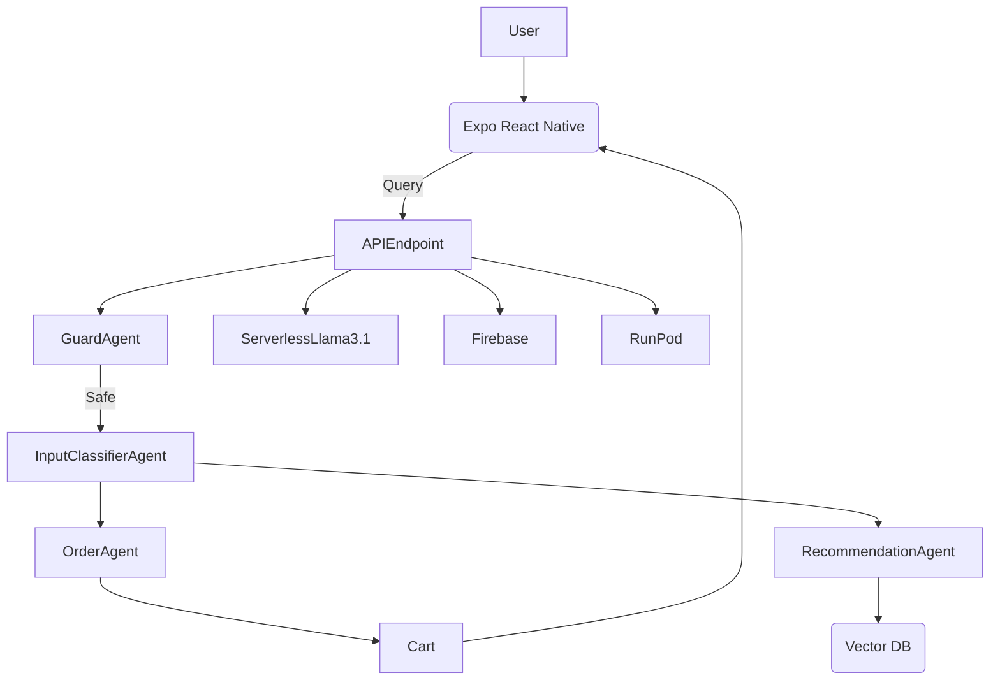
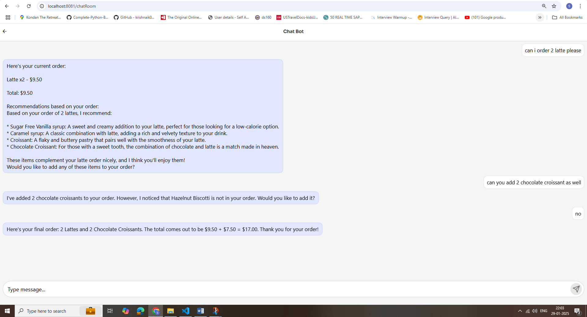
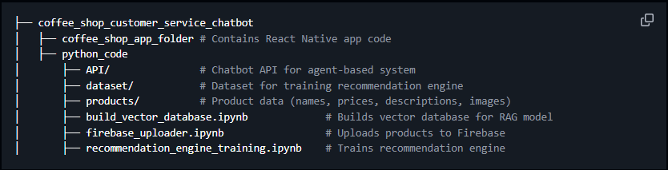

# ChatOrderAI

## 📌 Overview
ChatOrderAI is an AI-powered chatbot-driven ordering system designed to streamline shopping experiences. Using **Expo (React Native)** for the mobile interface and **serverless AI agents** (Llama 3.1, Pinecone, Firebase, and RunPod's infrastructure), this project enables users to add items to their cart via natural language commands. The system automatically updates the cart and displays the total in real-time.
## 🚀 Features
- **AI Chatbot for Shopping**: Users can interact with an AI assistant to browse and order products.
- **Automatic Cart Management**: The chatbot adds items to the cart upon user request and updates the total.
- **Personalized Recommendations**: AI suggests products based on previous purchases and trends.
- **Secure Input Handling**: Guard Agent ensures safe and appropriate user queries.
- **Expo-based Mobile App**: A seamless and interactive user experience on Android & iOS.
- **Retrieval-Augmented Generation (RAG)**: Provides detailed menu queries and allergen information.
- **Market Basket Analysis**: AI-based product recommendations using the Apriori algorithm.

## 🏗️ Tech Stack
- **Frontend**: React Native (Expo)
- **Backend**: Serverless API with AI agents
- **AI Model**: Llama 3.1
- **Database**: Firebase (for user data), Pinecone (vector database for recommendations)
- **Hosting**: Serverless architecture using **RunPod**

## 📜 Architecture

## 🛠️ Setup Guide
### Prerequisites
- Node.js & npm/yarn
- Expo CLI
- Firebase account

## 🛎️ How It Works
1. **User Interaction**: The user asks the chatbot to add items (e.g., "Add a latte to my cart").
2. **Agent Processing**:
   - The **Guard Agent** ensures the request is valid.
   - The **Input Classifier Agent** routes the request.
   - The **Order Agent** updates the cart.
   - The **Recommendation Agent** suggests relevant items.
   - The **Details Agent (RAG System)** fetches specific menu information.
3. **Response & Updates**: The app updates the cart and displays the new total.

## 🖼️ Project Screenshots

## 🚧 Challenges & Solutions
| Challenge | Solution |
|-----------|----------|
| Handling ambiguous user inputs | Implemented Guard Agent & Input Classifier Agent |
| Managing real-time cart updates | Integrated Firebase for instant UI updates |
| Generating personalized recommendations | Used Pinecone for AI-based vector search |
| Ensuring accurate order-taking | Implemented an Order Agent with chain-of-thought reasoning |
| Optimizing response time | Used RunPod for serverless LLM deployment |

## 🎯 Future Enhancements
- **Voice command support**
- **Payment integration**
- **Multi-language support**

## 🎉 Acknowledgment
Special thanks to **@codeinajiffy** for providing valuable insights through YouTube videos on this project. Your content was incredibly helpful in bringing this chatbot to life! 🚀

## 📩 Contact
For any queries, reach out via [sanchup123@gmail.com](mailto:sanchup123@gmail.com)
